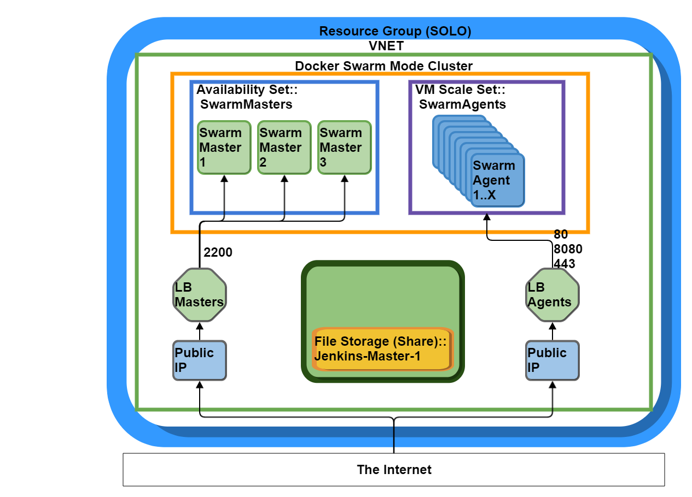

# ACS Engine

> The Azure Container Service Engine (acs-engine) generates ARM (Azure Resource Manager) templates for Docker enabled clusters on Microsoft Azure with your choice of DC/OS, Kubernetes, Swarm Mode, or Swarm orchestrators. The input to the tool is a cluster definition. The cluster definition is very similar to (in many cases the same as) the ARM template syntax used to deploy a Microsoft Azure Container Service cluster.

Meaning, for the time being we can utilize this to create the ARM templates.
These have to be rewritten to Terraform configuration files.

## Get started

Followed the [ACS Engine walkthrough](https://github.com/Azure/acs-engine/blob/master/docs/swarmmode.md).


## Inspiration

* https://github.com/joostvdg/autoscaling/blob/master/azuredeploy.parameters.json
* http://blog.geuer-pollmann.de/blog/2016/09/21/azure-germany-loves-packer/


## Flusso Fork for Drove

We have our a [Flusso fork of acs-engine](https://github.com/FlussoBV/acs-engine) to adjust the configuration to our specific needs.
The following things are changed:

* **examples/swarmmode.json**: adjust the model for generating the template, for creating smaller than default VM's (much cheaper) for initial tests.
* **parts/configure-swarmmode-cluster.sh**: adjust the docker daemon configuration to enable the prometheus metrics endpoint

```bash
-H fd:// --experimental=true --metrics-addr=0.0.0.0:4999
```

## Docker Swarm Mode Walkthrough

The following schematic shows what resources the ACS template will generate for us.

Please, first make sure you know the different [Azure resources](../azure/).
Once you're familiar with them, read about the [ACS Engine](../azure/acs-engine). 
The scripts in this project you will need to generate the JSON templates which
actually do the provisioning of the Azure resources. Without it, you should create
the templates manually (This is not a wise idea).



Then, follow these steps.

1. Prepare the Azure Resource Manager (see below)
1. [Prepare the Azure CLI](../azure/#azure-cli). The CLI is used to create and maintain
resources in Azure. It acts as an API to programatically maintain the resources instead
of using the GUI. The end-result should be identical.
1. Understand the parameters for the ACS Engine for Drove (see below)
1. [ACS Engine Swarm Mode Walkthrough](../azure/acs-engine#docker-swarmmode-walkthrough)
1. Execute the Post Install steps (see below)

Keep track of the following things:

* The admin user name you configured in the ACS Engine model (if in doubt, assume **flusso**)
* The private part of the public ssh key part you put in the ACS Engine model
* The DNS names of the manger and worker public IP addresses

## Prepare your Azure Resource Manager

## Parameters for the ACS Engine

## Post Install

As of 04-03-2017, not everything is convered in the scripts yet.
We need to do some extra steps.

* Install Azure File Storage Driver (for docker [volume mounts](https://docs.docker.com/engine/tutorials/dockervolumes/))
* Install the Docker Swarm services that make up [Drove](../drove).
* Manually finish the Grafana configuration
* Manually finish the Jenkins configuration

### Install Azure File Storage Driver

In case you're not familiar with the Azure File Storage Driver, please [read up](../azure#azure-file-docker-volume-driver).

In the Drove project's root/azure/azure-storage-driver you find the required files for the driver and its installation.
For using and installing the driver, the following steps need to be undertaken.

* In Azure, create a Storage Account
* Generate keys for this Storage Account
* Configure the name and one of the two key's in the **azure-storage-driver/azurefile-dockervolumedrive.default** file
* Copy the files over to the first Swarm Manager 
* Copy the private key to the first Swarm Manager
* Log into the first Swarm Manager
    * Find out all node names in the cluster 
        ```bash
        docker node ls
        ```
    * Copy the **azure-storage-driver** folder to all nodes 
        ```bash
          scp -r azure-storage-driver/ ${node_hostname}:/home/${admin_user}
        ```
    * Install the driver on each machine 
        ```bash
          sudo ./azure-storage-driver/install.sh
        ```

If the installation is successful, it should look like this:

```bash
Reading package lists... Done
Building dependency tree       
Reading state information... Done
cifs-utils is already the newest version (2:6.4-1ubuntu1).
0 upgraded, 0 newly installed, 0 to remove and 133 not upgraded.
Created symlink from /etc/systemd/system/multi-user.target.wants/azurefile-dockervolumedriver.service to /etc/systemd/system/azurefile-dockervolumedriver.service.
● azurefile-dockervolumedriver.service - Azure File Service Docker Volume Driver
   Loaded: loaded (/etc/systemd/system/azurefile-dockervolumedriver.service; enabled; vendor preset: enabled)
   Active: active (running) since Fri 2017-03-03 16:19:28 UTC; 35ms ago
     Docs: https://github.com/Azure/azurefile-dockervolumedriver/
 Main PID: 2657 (azurefile-docke)
    Tasks: 4
   Memory: 880.0K
      CPU: 2ms
   CGroup: /system.slice/azurefile-dockervolumedriver.service
           └─2657 /usr/bin/azurefile-dockervolumedriver
```


### Result

```
data:    agentpublicFQDN  String  drove-swarm-agent.westeurope.cloudapp.azure.com 
data:    masterFQDN       String  drove-swarm-master.westeurope.cloudapp.azure.com
```

## Next Step

Once the infrastructure is created, you can proceed with [Installing Drove](../drove/drove-on-azure/).