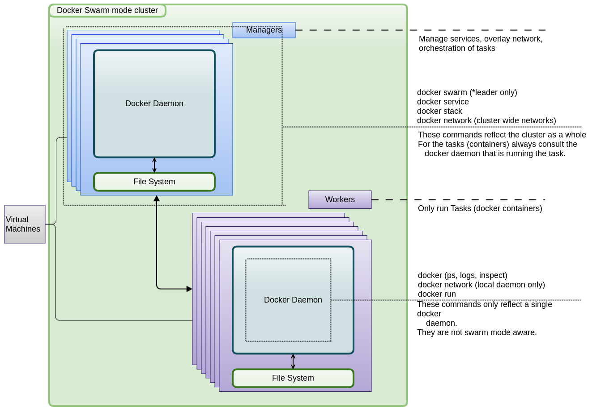

# Swarm Mode

Before you go further, please read [Docker Swarm Mode Overview](https://docs.docker.com/engine/swarm/).
 
After this, you can either follow the [Docker Swarm Tutorial](https://docs.docker.com/engine/swarm/swarm-tutorial/) or the steps below.

## Swarm Mode context explanation




## Learn by doing with Docker Machine

How do I get a cluster running to have multiple Docker Swarm Mode nodes?

Use [Docker Machine](https://docs.docker.com/machine/overview/#why-should-i-use-it).

### Requirements
* docker version 1.12.1+
* docker-machine 0.8.1+

### Key Concepts
* **Swarm**: A swarm is a cluster of Docker engines, or nodes, where you deploy services
* **Node**: A node is an instance of the Docker engine participating in the swarm
* **Service**: A service is the definition of the tasks to execute on the worker nodes. It is the central structure of the swarm system and the primary root of user interaction with the swarm.
    * **Replicated**: In the replicated services model, the swarm manager distributes a specific number of replica tasks among the nodes based upon the scale you set in the desired state.
    * **Global**: For global services, the swarm runs one task for the service on every available node in the cluster.
* **Task**: A task carries a Docker container and the commands to run inside the container.
* **Manager**: The manager node dispatches units of work called tasks to worker nodes. Manager nodes also perform the orchestration and cluster management functions.
* **Worker**: Worker nodes receive and execute tasks dispatched from manager nodes 
* **Overlay Network**: please see [get started with overlay](https://docs.docker.com/engine/userguide/networking/get-started-overlay/).
* **[Docker Machine](https://docs.docker.com/machine/overview/)**: Docker Machine is a tool that lets you install Docker Engine on virtual hosts, and manage the hosts with docker-machine commands

For more information, please read [Swarm mode key concepts](https://docs.docker.com/engine/swarm/key-concepts/).

### Docker Machine context explanation


### Create the machines

```bash
docker-machine create --driver virtualbox manager1
docker-machine create --driver virtualbox worker1
docker-machine create --driver virtualbox worker2
```

And use the following command to see if they are all up.

```bash
docker-machine ls
```

It should look like this.

```bash
NAME      ACTIVE   DRIVER       STATE     URL                         SWARM   DOCKER        ERRORS
manager1  -        virtualbox   Running   tcp://192.168.99.100:2376            v17.03.0-ce   
worker1   -        virtualbox   Running   tcp://192.168.99.101:2376            v17.03.0-ce   
worker2   -        virtualbox   Running   tcp://192.168.99.102:2376            v17.03.0-ce
```

### Set manager1 in Swarm Mode

Use the docker-machine env to set you docker daemon context to the virtualbox's docker daemon.

```bash
eval $(docker-machine env manager1)
```

Once in this context, you can initialize the Swarm Mode on the virtual box vm called manager1.
We have to use --advertise-addr <Network Inteface IP> to tell Docker Swarm which Network Interface to use for its protocols.  

```bash
docker swarm init --advertise-addr 192.168.99.100
```

Now that we're in Swarm mode, you can chech which nodes are part of your cluster.

```bash
docker node ls
```

This output should like this:

```bash
ID                           HOSTNAME  STATUS  AVAILABILITY  MANAGER STATUS
eul865rx6kv9004tpm84m6oil *  manager1    Ready   Active        Leader
```

Now we can generate tokens which other VM's can use to join the Swarm.
There are two types of tokens, manager and worker.
In this case we're going to use two workers, so we generate a worker token.

```bash
docker swarm join-token worker
```

### Connect worker to manager1

Use the join-token you got from the manager1 (see above).
Do this for both workers.

```bash
eval $(docker-machine env worker1)
docker swarm join \
    --token SWMTKN-1-3bba2lvfpfzp1z2cqbf1u57vgyrpgia6qmeaa02kz7i2lp657h-azxhbo7f4n269ee7utl6ccqq0 \
    192.168.99.100:2377
```

Now you can go to the manager1 again and see if there are now more nodes in the cluster.

```bash
docker node ls

ID                           HOSTNAME  STATUS  AVAILABILITY  MANAGER STATUS
0fmuyi8fh5qb7n4qr9c253idw    worker2   Ready   Active        
eul865rx6kv9004tpm84m6oil *  manager1  Ready   Active        Leader
l3caaz6wcahf61v98huchivl0    worker1   Ready   Active
```


### Network

Once you're going to run a lot of docker contiainers on a cluster, you're going to run into several things.
One of these things is that you want your applications that work together can find eachother.
  
If they are within the same [overlay network](https://docs.docker.com/engine/swarm/networking/) they can use their service name (see below).
This also allows for securing applications and application groups in virtual networks.

Lets create a simple overlay network for our first containers.

```bash
eval $(docker-machine env manager1)
docker network create --driver overlay --subnet 10.0.9.0/24 ci
```

### Services

If you want to run docker containers in swarm mode, you must create them as a service.
Please read the [tutorial](https://docs.docker.com/engine/swarm/swarm-tutorial/deploy-service/).

When you want to make a service, you need to do this on the manager1 node of the swarm.


!!! tip
    Each node in the Docker Swarm, needs to have the docker images you want to run as a service.
    If you build the images yourself, you need to build the images on each Docker Machine VM.
    You can do this by setting the context (via eval) to the VM and then build your image.
 
#### Jenkins Master

Using image [flusso/drove-jenkins-master](https://hub.docker.com/r/flusso/drove-jenkins-master/) created from [github/flusso](https://github.com/FlussoBV/drove-jenkins-master).

```bash
eval $(docker-machine env manager1)
docker service create --name jm1 --network ci --replicas 1 --publish 8080:8080 --publish 50000:50000 flusso/drove-jenkins-master
```

Get the admin user password from Jenkins manager1 [see jenkins2 install](https://jenkins.io/download/).
Or, if you're on the node that runs the image, you can run the following.

To find out where, run: ```docker service ps jm1```

```bash
docker ps
docker exec  jm1.1.pxsqlqwk1duxf7k0904yn1ihb  cat /var/jenkins_home/secrets/initialAdminPassword
```

Once you've retrieved the password, you can proceed to login into Jenkins for the first time.
It should prompt you for the initial admin's password.

When you've enter the password it will load the rest of the setup.
You can skip this (close the menu with the X in top right) as all plugins are already installed.
Now that Jenkins and its admin user are usable, we can connect the build slaves to this instance. 

!!! hint
    Each node in the Swarm cluster would need to have the image locally before it can start the first container.
    Especially the first time it would have to download the image and this can take some time.
    Sometimes a timeout occurs before it is fully downloaded, resulting in a failed start with no apparent error. 
    The Swarm cluster will usually try again on another node, this is normal behaviour. 

#### Jenkins Slave

We're going to create Jenkins slaves that will automatically connect themselves to their Jenkins Master, via the [Swarm Plugin](https://wiki.jenkins-ci.org/display/JENKINS/Swarm+Plugin).
We're going to set them to [--mode global](https://docs.docker.com/engine/reference/commandline/service_create/) so that any node will run the slave and [--constraint 'node.role==worker'](https://docs.docker.com/engine/reference/commandline/service_create/) to make sure they only run on worker nodes.

Using image [vfarcic/jenkins-swarm-agent](https://hub.docker.com/r/vfarcic/jenkins-swarm-agent/) from [docker-jenkins-slave-dind](https://github.com/vfarcic/docker-jenkins-slave-dind).

!!! warning
    You first need to get the password of the admin user (either the default or your own) of Jenkins, and replace the XXXX with that password.
    Also make sure the user you're going to use had admin rights and has logged in at least once.

```bash
eval $(docker-machine env manager1)
PASS=XXXXXXXXXXXXXX
docker service create --name jms-agent \
            -e COMMAND_OPTIONS="-master \
            http://192.168.99.100:8080/jenkins\
            -username admin -password $PASS \
            -labels 'docker' -executors 2" \
            --mode global \
            --constraint 'node.role==worker' \
            --mount "type=bind,source=/var/run/docker.sock,target=/var/run/docker.sock" \
            --mount "type=bind,source=/tmp,target=/workspace" \
            vfarcic/jenkins-swarm-agent
```

## Script

All of these steps are captured in a single script in case you want to reproduce this setup quickly.
See [Docker Swarm Scripts Demo's](https://gitlab.flusso.nl/CICD/drove/tree/master/swarm-scripts).